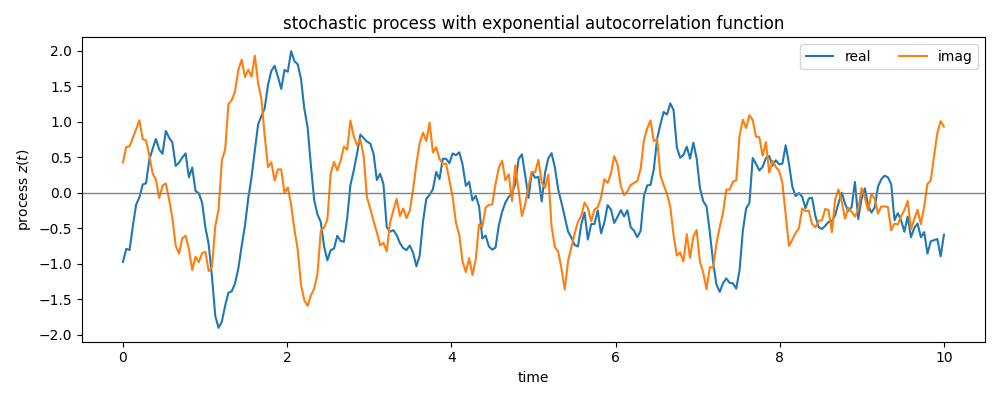

# Welcome to stocproc

The [`stocproc`][stocproc] module allows to sample **complex valued, wide sense stationary, Gaussian stochastic processes**
denoted by $z(t)$ fully defined by their first and second moments

$$
    \langle z(t) \rangle = 0\;, \quad \langle z(t)z(s) \rangle = 0 \quad 
    \text{and} \quad \langle z(t)z^\ast(s) \rangle = \alpha(t-s) \, .
$$

Fo far, four (more or less) different methods have been implemented:

* [`stocproc.samplers.KarhunenLoeve`][]
* [`stocproc.samplers.FastFourier`][]
* [`stocproc.samplers.TanhSinh`][]
* [`stocproc.samplers.Cholesky`][]

## Simple Example
For the impatient, here a simple example.

```python
import numpy as np
import stocproc as sp

def lsd(w):
    # Lorenzian spectral density
    return 1/(1 + (w - _WC_)**2)

def exp_ac(t):
    # exponential auto correlation function
    # note there is a factor of one over pi in the definition of the auto correlation function
    # exp_ac(t) = 1/pi int_{-infty}^infty d w  lsd(w) exp(-i w t)
    return np.exp(- np.abs(t) - 1j*_WC_*t)

_WC_ = 5
t_max = 10
# setup process generator (using FFT method)
stp = sp.StocProc_FFT(
    spectral_density=lsd,
    t_max=t_max,
    alpha=exp_ac,
    intgr_tol=1e-2,            # integration error control parameter
    intpl_tol=1e-2,            # interpolation error control parameter
    negative_frequencies=True, # due to the Lorentzian spec. dens.
    seed=1                     # fixed a particular process
)  
# generate a new process
stp.new_process()
t = np.linspace(0, t_max, 250)
# return the values of the process for the time t
zt = stp(t)
```


[Link the code including the plotting](./pythonsnippets/example_simple.md)


## Install and build

install the latest release via `pip`

    pip install stocproc

fetch the bleeding edge version from the [git repo](https://github.com/cimatosa/stocproc)
and install with [poetry](https://python-poetry.org/docs/#installation)

    git clone https://github.com/cimatosa/stocproc.git
    cd stocproc
    poetry install

build the cython extension with

    poetry build

## Contributors

* [Richard Hartmann](https://github.com/richard-hartmann/)
* [Valentin Boettcher](https://github.com/vale981)

## MIT License

Copyright © 2023 Richard Hartmann

Permission is hereby granted, free of charge, to any person obtaining a copy of 
this software and associated documentation files (the “Software”), 
to deal in the Software without restriction, including without limitation the 
rights to use, copy, modify, merge, publish, distribute, sublicense, and/or 
sell copies of the Software, and to permit persons to whom the Software is 
furnished to do so, subject to the following conditions:

The above copyright notice and this permission notice shall be included in 
all copies or substantial portions of the Software.

THE SOFTWARE IS PROVIDED “AS IS”, WITHOUT WARRANTY OF ANY KIND, 
EXPRESS OR IMPLIED, INCLUDING BUT NOT LIMITED TO THE WARRANTIES OF 
MERCHANTABILITY, FITNESS FOR A PARTICULAR PURPOSE AND NONINFRINGEMENT. 
IN NO EVENT SHALL THE AUTHORS OR COPYRIGHT HOLDERS BE LIABLE FOR ANY CLAIM, 
DAMAGES OR OTHER LIABILITY, WHETHER IN AN ACTION OF CONTRACT, TORT OR OTHERWISE, 
ARISING FROM, OUT OF OR IN CONNECTION WITH THE SOFTWARE OR THE USE OR OTHER DEALINGS IN THE SOFTWARE.
